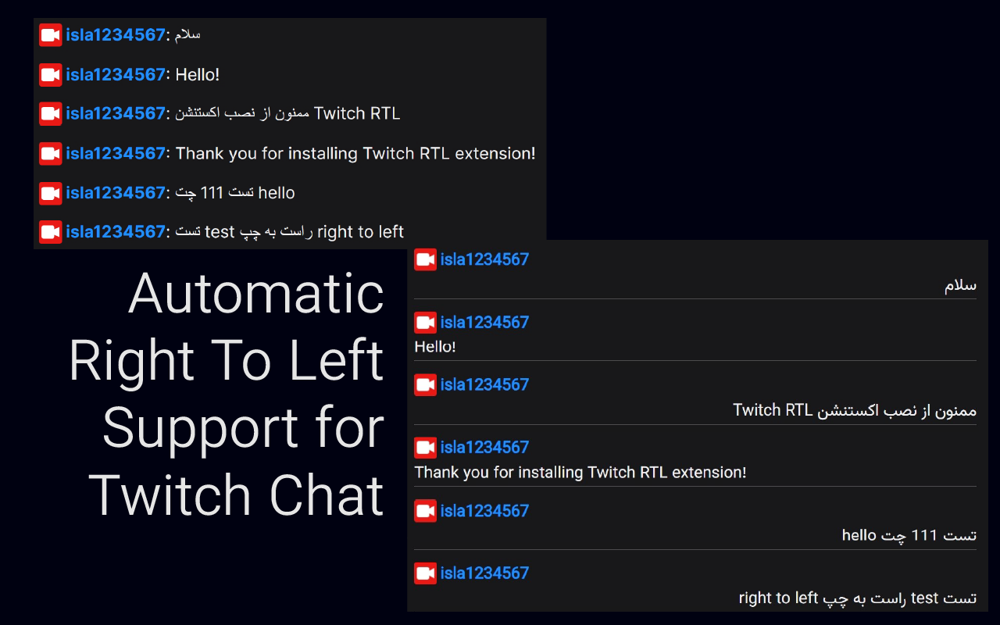
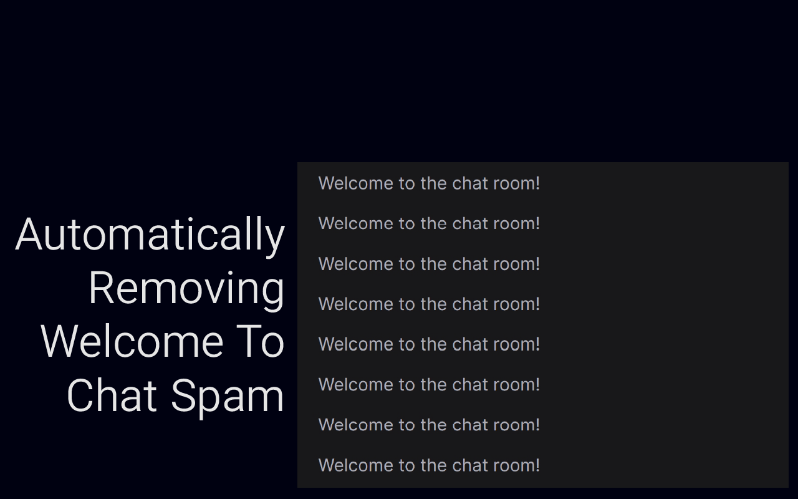
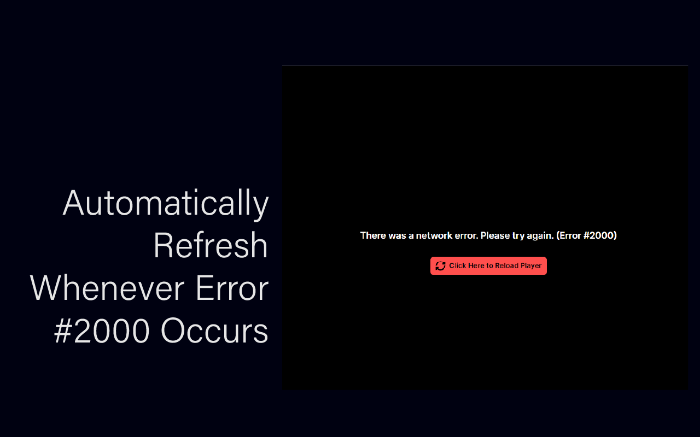

Twitch RTL is a browser extension designed to enhance the viewing experience on Twitch by providing support for right-to-left (RTL) languages such as Arabic and Persian in the chat. It dynamically applies custom CSS styles, including the use of the Vazirmatn font, to ensure chat messages are displayed properly with RTL alignment. The extension modifies chat messages as they appear, ensuring that users who speak RTL languages have an optimal viewing experience without any manual intervention. It automatically detects Arabic or Persian text and adjusts the layout to accommodate these languages, improving readability and overall chat usability on Twitch.

⭐ Other Features:
Auto Decline Cookies
Font Select Options For Chat
Auto Refresh Chat on Reconnect Bug

