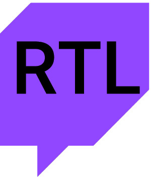
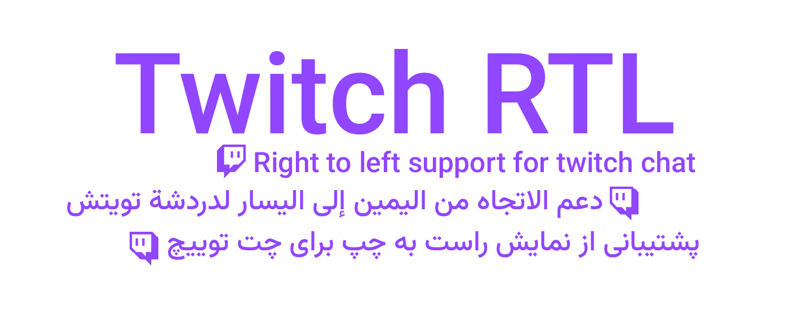
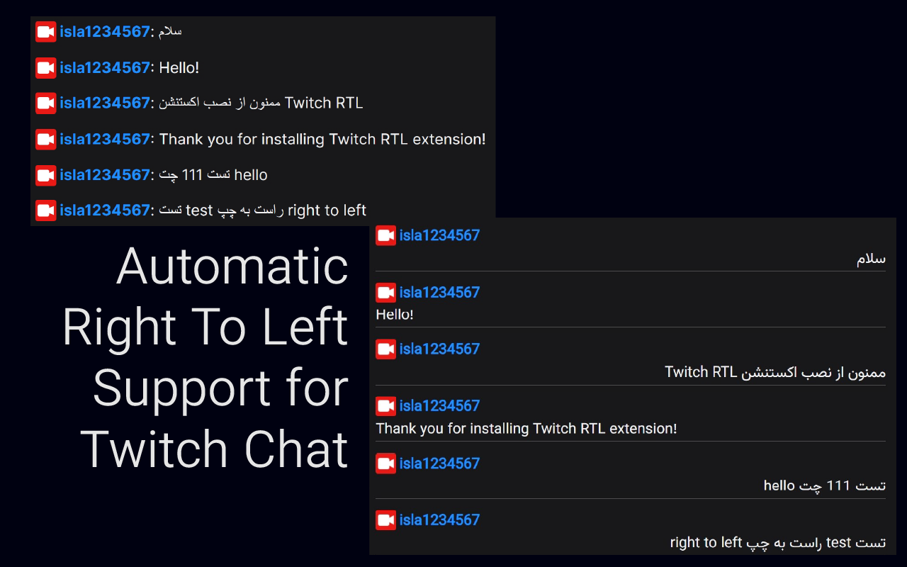
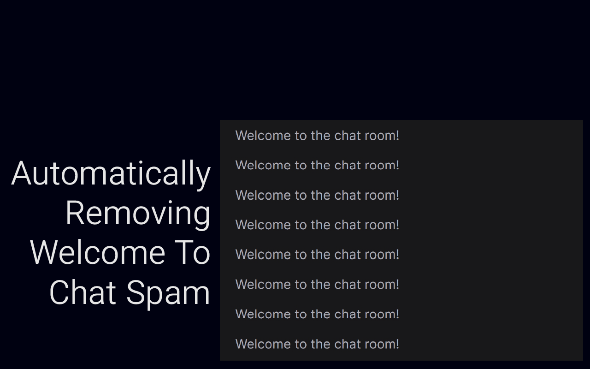
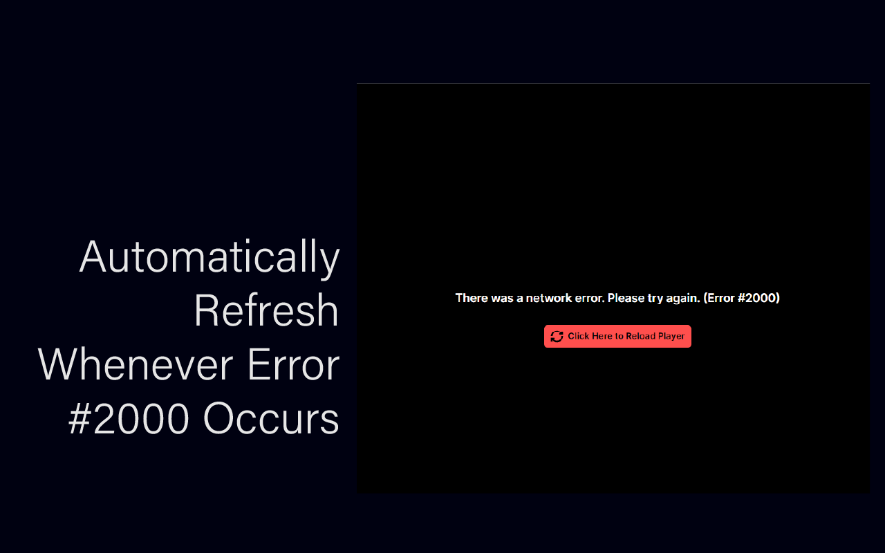

Twitch RTL is a browser extension designed to enhance the viewing experience on Twitch by providing support for right-to-left (RTL) languages such as Arabic and Persian in the chat. It dynamically applies custom CSS styles, including the use of the Vazirmatn font, to ensure chat messages are displayed properly with RTL alignment. The extension modifies chat messages as they appear, ensuring that users who speak RTL languages have an optimal viewing experience without any manual intervention. It automatically detects Arabic or Persian text and adjusts the layout to accommodate these languages, improving readability and overall chat usability on Twitch.

- It's an Open Source project! (Wait what?)
- It makes the chat right to left automatically (WINDOWS_PASHMAM_EMOJI)
- It fixes the freaking "Welcome to chat" spam by twitch (twitch )
- It auto reloads twitch chat on reconnect (🔌)
- YOU CAN CHANGE CHAT'S FONT (WOW!!!!!!!!!)
- Other features (100% truth no lie vallahi):
- Auto claim drop
- auto refresh when error #2000 occurs
- Automatically Decline Cookies
- No Data Collect!!!! (You Can See The Codes Bro)

- 🧭 [Edge](https://microsoftedge.microsoft.com/addons/detail/twitch-rtl/jpmknenijonkbmkiodefkofihahalmna) Out Now!
- 🦊 [Firefox](https://addons.mozilla.org/en-US/firefox/addon/twitch-rtl/) Out Now!
- 🟡 [Chrome](https://github.com/alirezaabdi01) Coming Soon..

